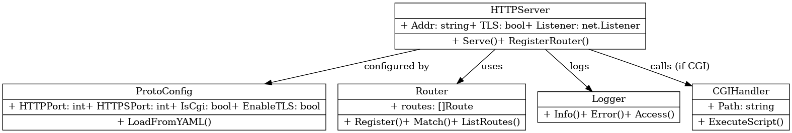
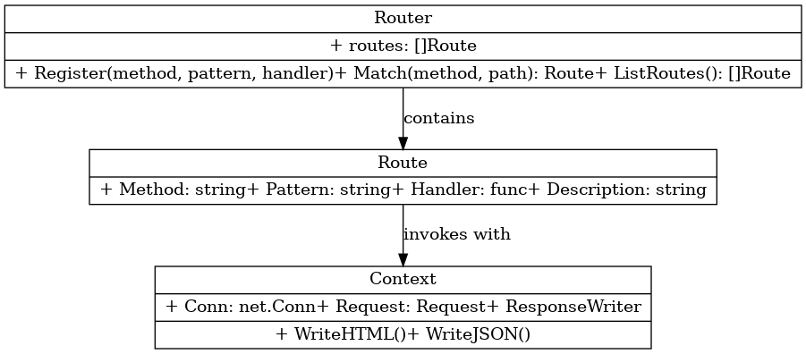
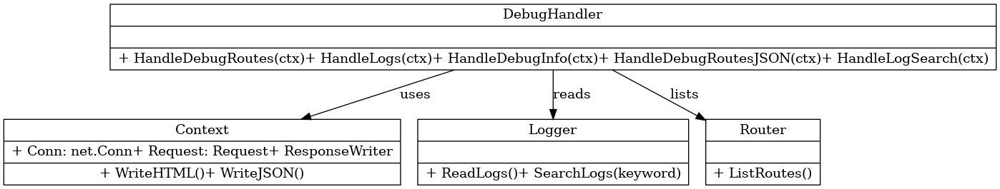
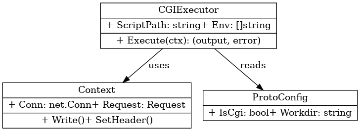
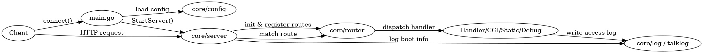

# 🌐 HTTP/HTTPS 服务器模块说明文档
**by 网安2201常兆鑫 计科2205李雨轩**
----
# ✅ 项目功能总览：HTTP/HTTPS 服务器

## 🚀 启动与配置

- [x] 从 `config.yml` 加载配置项
- [x] 支持 IPv4、IPv6、双栈（DualStack）监听
- [x] 支持 HTTP 与 HTTPS 两种协议（可选开启 TLS）
- [x] 配置可控制：
  - HTTPPort / HTTPSPort
  - 是否启用 CGI（`IsCgi`）
  - 服务器工作目录（`Workdir`）
  - 强制 IPv4（`ForceIPV4`）
  - TLS 证书文件路径（`CertFile` / `KeyFile`）

## 🌐 HTTP 服务核心功能

- [x] 支持 HTTP/1.1 协议
- [x] 支持常见方法：GET、POST、HEAD
- [x] 实现 Keep-Alive 连接保持机制
- [x] 请求多路并发处理（基于 goroutine）
- [x] 响应支持分块传输（Chunked Transfer Encoding）
- [x] 请求超时与连接超时控制（Deadline）

## 📁 静态资源服务

- [x] 支持静态文件访问（文件/目录）
- [x] 自动解析 MIME 类型
- [x] 目录浏览功能（可列出目录结构）

## ⚙️ CGI 动态内容支持

- [x] 支持配置 CGI 路由
- [x] 使用外部程序处理请求，支持：
  - 设置 CGI 环境变量（如 REQUEST_METHOD, QUERY_STRING）
  - 读取标准输入（POST 数据）
  - 输出标准输出（响应正文）

## 🧪 调试与监控接口

通过 `/debug` 路由访问，支持：

- [x] HTML 页面展示当前注册的所有路由
- [x] JSON 格式展示路由结构（用于自动化解析）
- [x] 系统信息展示（GOOS/GOARCH, CPU, Mem 使用率）
- [x] 实时日志浏览
- [x] 日志关键字搜索功能

## 🗂 路由管理

- [x] 支持动态路由注册与匹配
- [x] 区分请求方法（Method）与路径（Pattern）
- [x] 每条路由支持附带描述（用于调试面板）

## 🛠 中间层与请求处理上下文

- [x] 每个请求封装为 `Context` 结构：
  - `Request`、`Conn`、响应输出等封装
  - 支持 HTML/JSON 输出方法
- [x] 请求路径匹配后调度给对应的 Handler 处理器

## 🪵 日志系统

- [x] 终端实时输出日志
- [x] 可选持久化至日志文件（默认每日分割）
- [x] 支持：
  - 启动日志（Boot）
  - 访问日志（Access）
  - 错误日志（Error）
  - 日志级别可控（Info/Warn/Error）

## 🧰 工具与辅助功能

- [x] 支持 IP 类型判断（IPv4/IPv6）
- [x] 自动检测路径是否合法（防止目录穿越）
- [x] 支持文件 MIME 类型识别
- [x] 可设置文件响应时的 Content-Type 和 Content-Length

## 🔐 HTTPS 与安全支持

- [x] 可开启 HTTPS（通过配置 EnbaleTLS）
- [x] 自定义证书/私钥路径
- [x] 支持仅启用 HTTPS 或 HTTP + HTTPS 双监听

## 🧩 项目模块结构概览

项目采用模块化设计，主要分为以下几个核心模块：

| 模块路径                        | 功能描述                          |
| --------------------------- | ----------------------------- |
| `core/config`               | 配置管理（如 HTTP/HTTPS 端口、TLS 开关等） |
| `core/server`               | HTTP(S) 服务器主逻辑，包含监听、调度、请求处理等  |
| `core/router`               | 路由管理与注册逻辑                     |
| `core/cgi`                  | CGI 程序调用与管理                   |
| `core/log` / `core/talklog` | 日志输出与事件记录                     |
| `core/debug`                | 调试面板接口（如路由查看、日志搜索等）           |
| `core/util`                 | 通用工具函数（如文件读取、IP检测等）           |
| `cmd/main.go`               | 项目入口，根据配置启动服务                 |

---

## 🔁 模块间调用关系图（文本描述）

```text
main.go
  └──> core/config               # 加载配置
  └──> core/server.StartServer  # 启动服务器（传入路由表）

core/server
  └──> core/router.NewRouter            # 初始化路由器
  └──> core/router.Router.Register(...)# 注册常规路由、静态路由、CGI路由、调试路由
  └──> net.Listen(...)                  # 启动 TCP/HTTPS 服务
  └──> core/config.ProtoConfig         # 判断是否启用 CGI、TLS、DualStack 等
  └──> core/cgi                        # 执行 CGI 脚本请求
  └──> core/util                       # 工具函数（如 MIME、IP、路径）
  └──> core/talklog.Logger             # 日志记录

core/debug
  └──> core/router.Router              # 调试页需访问注册路由等结构
  └──> net.Conn (Conn 接口传入 context) # 支持 HTML/JSON 两种格式输出

core/router
  └──> Handler 包                      # handler 逻辑模块注册，如 debug、cgi、static
```

---

## 🔎 模块功能详解

### 1. `core/config` – 配置系统

- 支持从 YAML 文件读取参数（如 IPv6 开关、TLS 文件路径等）。
- 提供 `ProtoConfig` 结构体描述运行模式（如 CGI 开启、启用 TLS）。
- 所有配置值被加载到 `globalconfig.GlobalConfig`。

### 2. `core/server` – 主服务器模块

- 支持 HTTP/1.1 标准。
- 支持：
  - `GET` / `POST` / `HEAD` 请求；
  - Keep-Alive；
  - 多线程并发处理；
  - 路由表调度；
  - CGI 执行；
  - HTTPS 支持；
  - IPv4 / IPv6 / DualStack；
- 主入口 `StartServer()` 使用配置启动监听器。

### 3. `core/router` – 路由管理器

- 提供 `Router.Register()` 系列函数用于注册以下类别：
  - 通用业务逻辑路由；
  - 静态文件路由；
  - 调试路由；
  - CGI 路由。
- 支持路径匹配、Method 匹配等。

### 4. `app/debug` – 调试模块


- 提供 `/debug` 接口组，支持：
  - 查看已注册路由（HTML/JSON）；
  - 查看系统信息（如 CPU/内存）；
  - 日志文件内容查看；
  - 日志搜索功能。
- 采用独立 HTML 模板输出。

### 5. `core/cgi` – CGI 管理模块

- 支持 `IsCgi` 配置下启用动态脚本处理。
- 每个 `.cgi` 路由绑定执行 `exec.Command(...)` 启动 CGI 程序。
- 环境变量等参数注入完整。
- 支持地址映射，访问cgi脚本无须在url中加入`/cgi-bin` or `/cgi`

### 6. `core/util` – 通用工具模块

- 提供路径安全处理、MIME 类型判断、IPv4/IPv6 判断、时间格式等通用函数。

### 7. `core/log` / `core/talklog` – 日志系统

- 支持终端输出 + 文件写入；
- 包含带时间戳的日志打印函数；
- debug 页面可查询日志内容。

---

## 🧮 请求处理流程简述

```text
[client request] --> net.Listener (server)
                  --> goroutine 处理连接
                    --> 解析 HTTP 请求头
                    --> 匹配 router
                      ├── 静态文件
                      ├── CGI 执行
                      ├── 注册处理器（如 debug）
                    --> 返回 HTTP 响应
                    --> 记录日志
```

---

## 🧱 模块扩展建议

| 目标                   | 建议模块                           | 描述                          |
| -------------------- | ------------------------------ | --------------------------- |
| 添加 RESTful 接口        | `core/router` + `core/handler` | 编写新 handler，并通过 Router 注册路径 |
| 支持 HTTP2 / WebSocket | `core/server`                  | 更换底层监听器或添加协议升级处理            |
| 增加缓存/防盗链功能           | `core/util` / `server` 中添加中间件  | 实现缓存控制头或 IP 检查              |
| TLS 热更新证书            | `core/server`                  | 使用 `GetCertificate` 动态证书加载  |

---


## 🧪 测试示例

- 智能协商返回格式：

```bash
curl -H "Accept: application/json" http://localhost:8000/debug/routes
```

- 强制关闭连接：

```bash
curl -H "Connection: close" -X GET localhost:8000/cgi-bin/test-echo.py
```

---

> 核心模块是独立的、通用的，业务逻辑是外部可插拔的。
